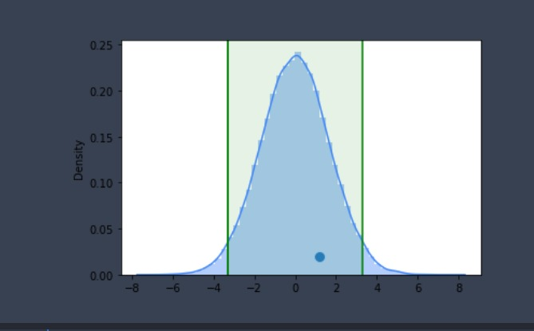

## 🔖 Sobre
Nesse notebook estamos abordando os principais testes de normalidade e testes de hipóteses. Como fonte desse trabalho estou utilizando o livro de estátistica do professor Peter Bruce.[Estatística prática para Cientistas de Dados](https://www.amazon.com.br/Estat%C3%ADstica-Pr%C3%A1tica-Para-Cientistas-Dados/dp/855080603X/ref=asc_df_855080603X/?tag=googleshopp00-20&linkCode=df0&hvadid=379765802390&hvpos=&hvnetw=g&hvrand=14597085526003803271&hvpone=&hvptwo=&hvqmt=&hvdev=c&hvdvcmdl=&hvlocint=&hvlocphy=20094&hvtargid=pla-812161948748&psc=1).

### 🔨️ Testes realizados

- Shapiro
- Jarque-Bera
- D'Agostino and Persons
- Anderson Darling
- Chi-Square
- Teste de Hipóteses
    - Bootstraping
- Wilcoxon Signed-Rank Test
- Test T
- Test T Paried
- Binomial

</br>

<p align="center"> 
  
</p>

</br>

## 🚀 Bibliotecas utilizadas

- [Plotly](https://plotly.com/)
- [Numpy](https://numpy.org/)
- [Matplotlib](https://matplotlib.org/)
- [Pandas](https://pandas.pydata.org/)
- [Seaborn](https://seaborn.pydata.org/)
- [Scipy](https://www.scipy.org/)
- [Statsmodels](https://www.statsmodels.org/)
</br>

## 🗂 Como baixar e iniciar o projeto

```bash
# Abra um terminal e copie este repositório com o comando
$ git clone https://github.com/cbvreis/estatistica-testes-hipoteses.git
# ou use a opção de download.

pip install -r requirements.txt

# Entrar no diretorio **/estatistica-testes-hipoteses**
$ cd estatistica-testes-hipoteses
```

Desenvolvido por [Cássio Reis](https://www.linkedin.com/in/cassioreisdevelop/) 🤓

